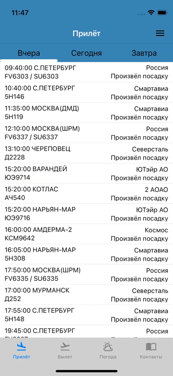
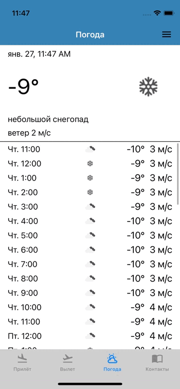
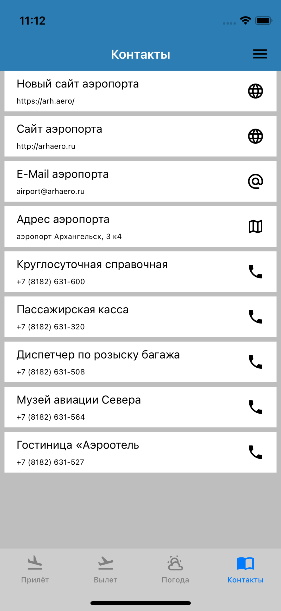
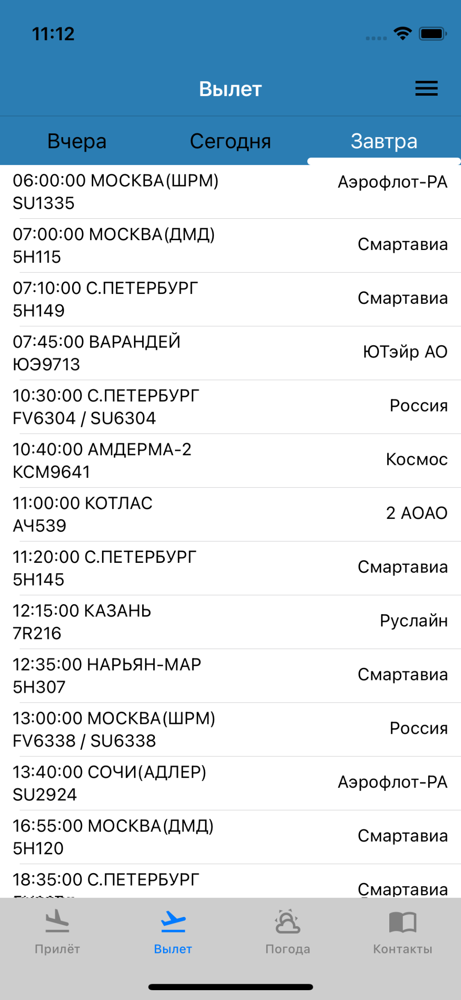
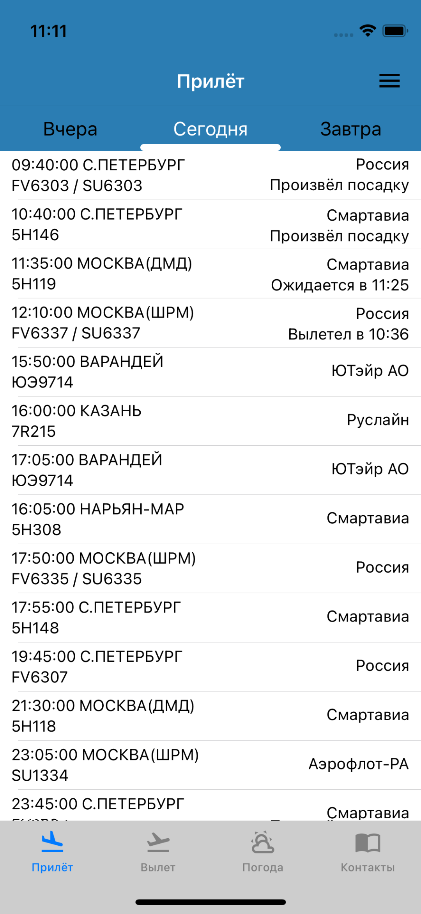

# ArhAirport

Приложение является неофициальным источником информации, для отслеживания авиарейсов в аэропорте "Талаги". Оффициальный сайт [Аэропорт Архангельск](https://arh.aero/).

Возможности: 
1) Просмотр авиарейсов как вылета так и прилёта, на сегодня, вчера, завтра
2) Просмотр текущей погоды со скоростью ветра и осадками, почасовой на 2 дня
3) Возможность быстро найти контакты аэропорта, сайт в браузере или розыск багажа

Сетевой слой работает в связке с базой данных, на случай потери интернета - будут отображаться последние данные

В дальнейшем планируется:
1. Реализовать возможность создавать избранный рейс с отслеживанием
2. Реализовать деталку выезда
3. Добавить меню с настройками

 
 

